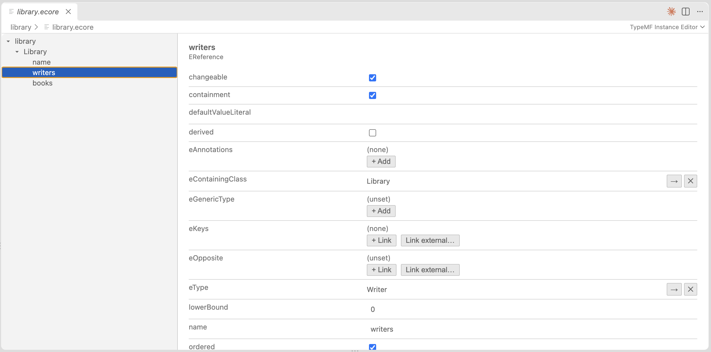

import { Steps } from '@astrojs/starlight/components';
import PipelineDiagram from '../../../components/PipelineDiagram.astro';
import ModelDiagram from '../../../components/ModelDiagram.astro';

<PipelineDiagram />

<Steps>

1. **Install the VS Code extension**

   Install the [TypeMF Instance Editor](https://marketplace.visualstudio.com/items?itemName=typemf.instance-editor) from the Visual Studio Marketplace. It depends on the TypeMF Runtime extension, which VS Code installs automatically.

2. **Create your first model**

   Create a file with the `.ecore` extension, for example `model/library.ecore`, and start editing it in VS Code.

   

3. **Install the generator**

   ```sh
   npm install @typemf/core
   npm install --save-dev @typemf/generator
   ```

4. **Add a generator config**

   Create `typemf-generator.config.json` next to your project. Paths are relative to the config file.

   ```json
   {
     "ecoreFile": "./model/library.ecore",
     "outputDir": "./src/generated",
     "templateSet": "typescript",
     "options": {}
   }
   ```

   `typescript` is currently the only template set.

5. **Run the generator**

   ```sh
   npx typemf-generate
   ```

   Pass a path to use a different config file: `npx typemf-generate path/to/config.json`.

</Steps>

## What gets generated

For an Ecore package `library` with the classes `Library`, `Writer` and `Book`:

```
LibraryPackage.ts          package interface
LibraryFactory.ts          factory interface
types/Book.ts              one interface per class
impl/BookImpl.ts           one implementation per class
impl/LibraryPackageImpl.ts
impl/LibraryFactoryImpl.ts
util/LibrarySwitch.ts      visitor with supertype fallback
util/LibraryTypeGuards.ts
```

All files are regenerated on every run, so don't edit them. To customize a class, subclass its `Impl` class and pass a factory that creates your subclass to `LibraryPackageImpl.init(factory)`, before anything accesses `LibraryPackageImpl.eINSTANCE`.

## The Library model

The examples use a small model: a `Library` contains `Writer`s and `Book`s, and `Writer.books` and `Book.author` are opposites. You can open the [`library.ecore`](https://github.com/typemf/typemf.dev/tree/main/examples/library) in the Instance Editor.

<ModelDiagram />

## Load and save a model

The generated package works with `@typemf/xmi`, which reads and writes the EMF XMI format. Install the serialization and Node.js packages:

```sh
npm install @typemf/xmi @typemf/node
```

```ts
import { EcorePackageImpl, ResourceSetImpl, URI } from '@typemf/core';
import { NodeFileUriConverter } from '@typemf/node';
import { registerXmiFormat } from '@typemf/xmi';
import { LibraryPackageImpl } from './generated/impl/LibraryPackageImpl.js';
import type { LibraryFactory } from './generated/LibraryFactory.js';
import type { Library } from './generated/types/Library.js';

EcorePackageImpl.eINSTANCE; // initialize Ecore before your own package
const pkg = LibraryPackageImpl.eINSTANCE;

const resourceSet = new ResourceSetImpl();
resourceSet.getUriConverterRegistry().register(new NodeFileUriConverter());
registerXmiFormat(resourceSet.getResourceFactoryRegistry());
resourceSet.getPackageRegistry().register(pkg);

const resource = await resourceSet.getResource(
  URI.createFileURI('/absolute/path/to/library.xmi'),
  true,
);
const library = resource!.getContents().get(0) as Library;

for (const writer of library.getWriters()) {
  console.log(writer.getName(), writer.getBooks().toArray().map((b) => b.getTitle()));
}

const factory = pkg.getEFactoryInstance() as LibraryFactory;
const book = factory.createBook();
book.setTitle('Children of Dune');
book.setAuthor(library.getWriters().get(0)); // also adds the book to the writer's books
library.getBooks().add(book);

await resource!.save();
```

Notes:

- Initialize `EcorePackageImpl.eINSTANCE` before your own package, otherwise the package fails to construct.
- Register the `EPackage` of every namespace used in a file before you load it.
- File URIs must be absolute. A document needs exactly one root object.

## Opposites and containment

References behave as in EMF. Setting one end of a bidirectional reference updates the other, and adding an object to a new container removes it from the old one.

```ts
import { EcorePackageImpl } from '@typemf/core';
import { LibraryPackageImpl } from './generated/impl/LibraryPackageImpl.js';
import type { LibraryFactory } from './generated/LibraryFactory.js';
import type { Library } from './generated/types/Library.js';

EcorePackageImpl.eINSTANCE;
const factory = LibraryPackageImpl.eINSTANCE.getEFactoryInstance() as LibraryFactory;

const writer = factory.createWriter();
const book = factory.createBook();

book.setAuthor(writer);
writer.getBooks().size(); // 1, the opposite was updated

const city = factory.createLibrary();
const campus = factory.createLibrary();
city.getBooks().add(book);
campus.getBooks().add(book); // moves the book
city.getBooks().size(); // 0
(book.eContainer() as Library) === campus; // true
```

Try it with the [Library example](https://github.com/typemf/typemf.dev/tree/main/examples/library): the `.ecore` model and a sample `library.xmi`.
